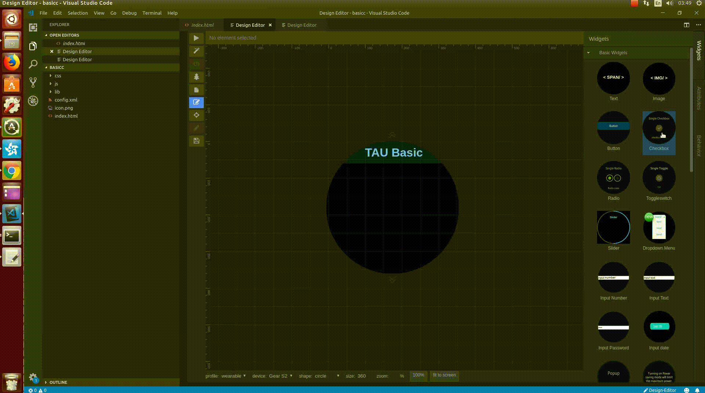
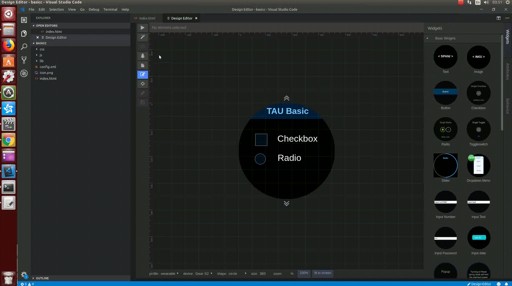
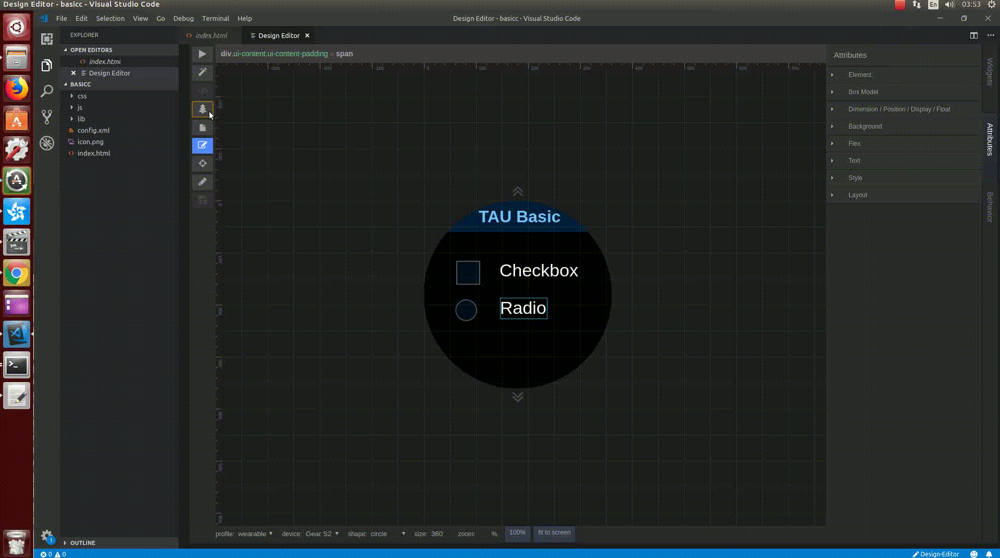
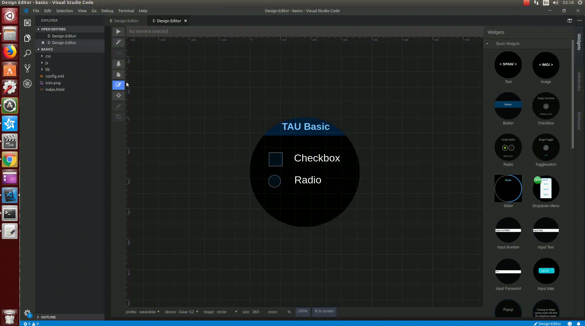
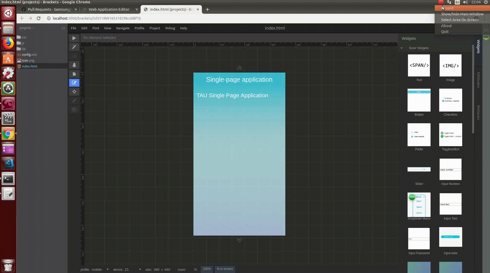
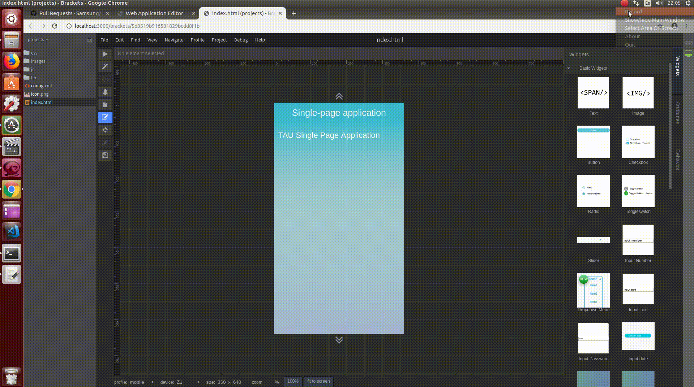

TAU Design Editor
=================
[](https://travis-ci.org/Samsung/TAU-Design-Editor)
[](https://github.com/Samsung/TAU-Design-Editor/issues)

This repository consists of Design Editor which offers WYSIWYG editing feature for TAU.
This repo is used by WATT open source.

## Getting Started

You can't use this repository standalone.
It doesn't offer any UI which could be tested. It can be used as a part of WATT or VSCode extension.

### Prerequisites

To build a TAU Design Editor ensure that you have Node.js (10.15.X) installed.

Example install using `nvm`:

```
nvm install 10.15.3
nvm use 10.15.3
```

Install depending modules using npm:
`npm install`

### Building for WATT
```
npm run build-watt
```
### Building for VSCode extension
```
npm run build-vsc
```

### How to use for WATT
```
1. Launch the WATT with Chrome -> New Project -> Web Application -> Sample -> Mobile -> General -> TAU BASE
2. Input the Project Name and select the Finish
3. Open the Project and select the .html file
4. Select Monitor icon at the top right
```

### Features
- Drag&Drop the widget (Wearable)

- Preview (Wearable)

- Structure Element (Wearable)

- Newpage (Wearable)

- Javascript Assistant (mobile)

- How to set the image (mobile)

- How to set the Dropdown items (mobile)

- How to make application (mobile)


### Coding style tests

Project has defined eslint rules (.eslintrc.js)

Contribution can be verified using command:

`grunt eslint`

## License

This project is licensed under MIT
